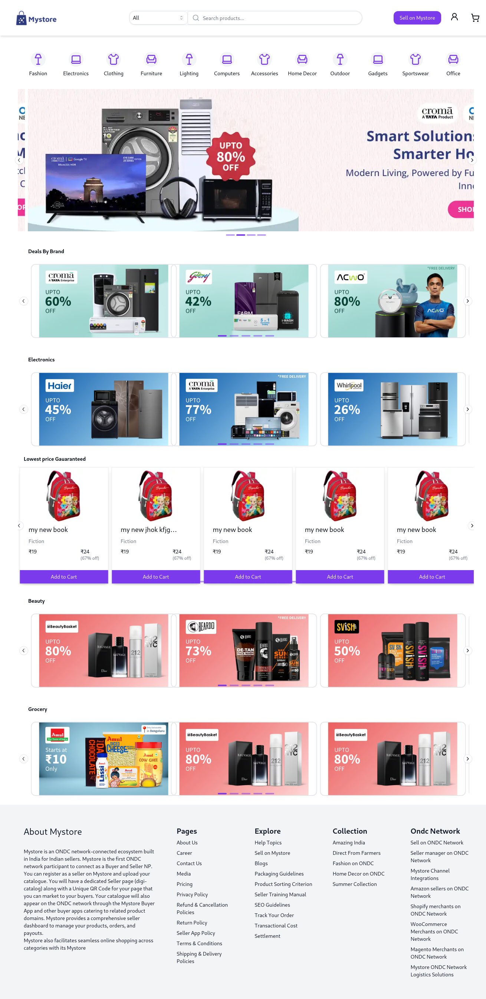
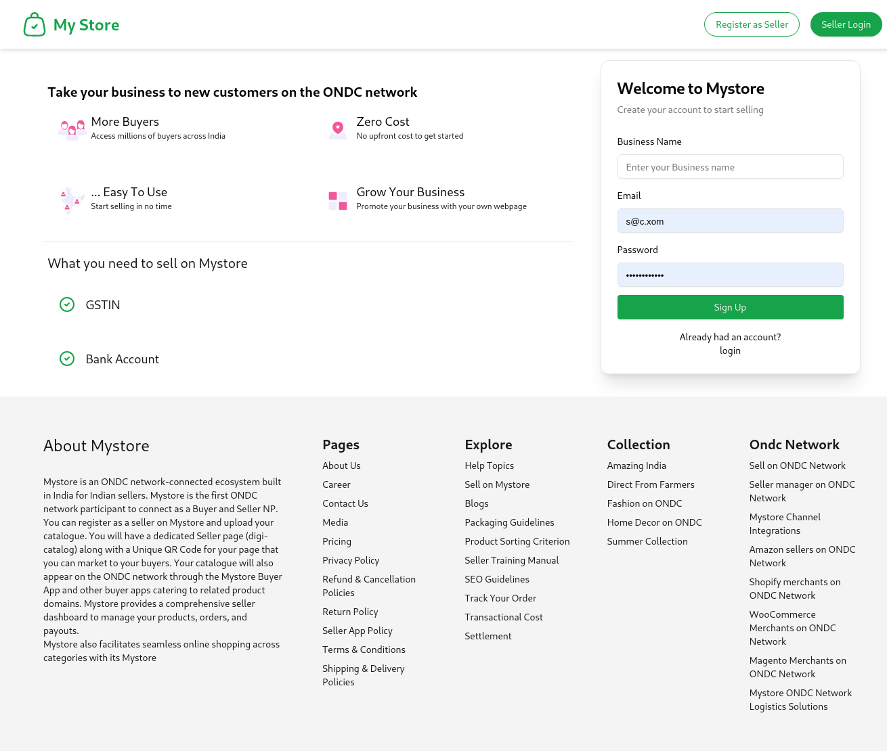

# MyStore - Full-Stack Ecommerce Monorepo

**Overview**  
MyStore is a full-stack ecommerce solution built with a modern monorepo architecture. It features an **Express.js backend** for robust API management and a **Next.js frontend** for server-side rendering, delivering a seamless shopping experience. The project leverages **Nx** for efficient build orchestration and scalable development.

---
```
## **Repository Structure**

mystore/
├── apps/
│   ├── ecommerce-buyer-app-backend/  # Express.js backend
│   └── web-app/                      # Next.js frontend
├── libs/
│   ├── db-postgres/                  # PostgreSQL database integration
│   ├── types/                        # Shared TypeScript types
│   ├── ui-kit/                       # Reusable UI components
│   └── ui/                           # Custom UI library
├── nx.json                           # Nx workspace configuration
├── package.json                      # Project dependencies
└── tsconfig.base.json                # TypeScript base configuration
```

---

## **Key Features**

### **Frontend (Next.js, React, TypeScript)**
- **Responsive Design**: Tailwind CSS-powered, cross-device compatible UI.
- **Dynamic Routing**: Product views, user interactions, and role-based access.
- **State Management**: Efficient API and state handling for seamless user experiences.
- **Payment Integration**: Razorpay integration for secure transactions.
- **Role-Based Access**: Authenticated routes for buyers and admins.

### **Backend (Express.js, TypeScript)**
- **RESTful APIs**: Scalable endpoints for ecommerce operations (products, orders, users).
- **Database**: PostgreSQL for robust data management.
- **Authentication**: JWT-based secure user authentication.
- **Order Processing**: End-to-end order management system.
- **File Management**: Structured handling of product images.

---

## **Development Setup**

1. **Clone the repository**:
   ```bash
   git clone https://github.com/your-org/mystore-ecommerce.git
   ```

2. **Install dependencies**:
   ```bash
   pnpm install
   ```

3. **Configure environment variables**:
   ```env
   BACKEND_URL=http://localhost:3001
   DB_USER=myuser
   DB_PASSWORD=mypassword
   DB_NAME=mydatabase
   DB_PORT=5432
   DB_HOST=localhost
   JWT_SECRET_KEY=your_secret
   RAZORPAY_KEY_ID=rzp_key_id
   RAZORPAY_KEY_SECRET=rzp_key_secret
   PORT=3001
   NEXT_PUBLIC_BACKEND_URL=http://localhost:3001
   NEXT_PUBLIC_RAZORPAY_KEY_ID=rzp_test_key
   NEXT_PUBLIC_RAZORPAY_KEY_SECRET=rzp_test_key_secret
   ```

4. **Start development servers**:
   ```bash
   nx run-many --target=serve --all=true --configuration=development
   ```

---

## **Build & Deployment**

### **Building for Production**
```bash
nx run-many --target=build --all=true --configuration=production
```
- Output is generated in the `dist/` directory.

### **Deployment**
- **Backend**: Deploy `dist/apps/ecommerce-buyer-app-backend` to a Node.js hosting environment (e.g., using PM2 for process management).
- **Frontend**: Deploy `dist/apps/web-app` to a static hosting service or SSR-capable platform.

---

## **Testing & Linting**
- **Run all tests**:
  ```bash
  nx run-many --target=test --all=true
  ```
- **Lint all projects**:
  ```bash
  nx run-many --target=lint --all=true
  ```

---

## **Contributing**
We welcome contributions! Here’s how:
1. Fork the repository.
2. Create a feature branch: `git checkout -b feature/my-new-feature`.
3. Commit your changes: `git commit -am 'Add some feature'`.
4. Push to the branch: `git push origin feature/my-new-feature`.
5. Submit a pull request.

---

## **License**
This project is licensed under the **MIT License**. See the [LICENSE](LICENSE) file for details.

---

## **Skills & Technologies**
- **Frontend**: Next.js, React, TypeScript, Tailwind CSS, Razorpay.
- **Backend**: Express.js, TypeScript, PostgreSQL, JWT Authentication.
- **Tools**: Nx, pnpm, Node.js, RESTful APIs, Monorepo Architecture.

## **Screenshots**



